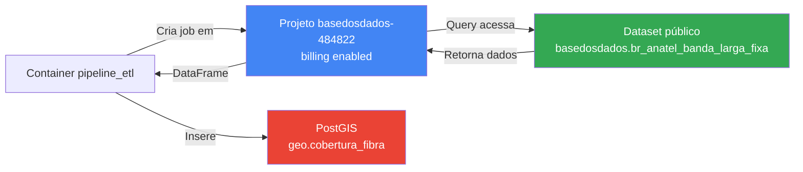

# Correção: Autenticação BigQuery com Projeto Faturador

## 🔧 Problema Identificado

**Erro**: `403 Access Denied: Project basedosdados: User does not have bigquery.jobs.create`

**Causa**: O script estava tentando criar jobs BigQuery no projeto público `basedosdados` (read-only), mas jobs precisam ser criados em um projeto com faturamento habilitado.

---

## ✅ Correções Aplicadas

### 1. Script `extrair_anatel.py`

#### Conexão BigQuery (linha 89-109)
```python
# ANTES
self.bq_client = bigquery.Client(project=self.project_id)
result = self.bq_client.query(query_test).result()

# DEPOIS
self.bq_client = bigquery.Client(project=self.project_id)
job_config = bigquery.QueryJobConfig(
    use_query_cache=False,  # Desabilitar cache para monitoramento preciso
    use_legacy_sql=False
)
result = self.bq_client.query(query_test, job_config=job_config).result()
```

#### Execução de Query (linha 147-165)
```python
# ANTES
job_config = bigquery.QueryJobConfig(
    use_query_cache=True,  # ❌ Cache habilitado
    use_legacy_sql=False
)

# DEPOIS
job_config = bigquery.QueryJobConfig(
    use_query_cache=False,  # ✅ Cache desabilitado para monitoramento preciso
    use_legacy_sql=False
)

# Comentários adicionados:
# Job criado em: self.project_id (ex: basedosdados-484822)
# Query acessa: basedosdados.br_anatel_banda_larga_fixa.microdados (público)
```

#### Função main (linha 375-400)
```python
# ANTES
project_id = os.getenv("GCP_PROJECT_ID", "basedosdados")

# DEPOIS
project_id = os.getenv("GOOGLE_CLOUD_PROJECT") or os.getenv("GCP_PROJECT_ID", "basedosdados-484822")
logger.info(f"Usando projeto faturador: {project_id}")
```

**Ordem de prioridade**:
1. `GOOGLE_CLOUD_PROJECT` (padrão Google Cloud)
2. `GCP_PROJECT_ID` (compatibilidade)
3. Fallback: `basedosdados-484822`

---

### 2. Arquivo `.env.example`

```bash
# ANTES
GCP_PROJECT_ID=basedosdados

# DEPOIS
# Projeto BigQuery FATURADOR (billing project) - onde os jobs serão criados
# IMPORTANTE: Use seu projeto com faturamento habilitado, não o projeto público
GOOGLE_CLOUD_PROJECT=basedosdados-484822
GCP_PROJECT_ID=basedosdados-484822
```

---

### 3. Arquivo `docker-compose.yml`

```yaml
# ANTES
environment:
  GCP_PROJECT_ID: ${GCP_PROJECT_ID:-basedosdados}

# DEPOIS
environment:
  GOOGLE_CLOUD_PROJECT: ${GOOGLE_CLOUD_PROJECT:-basedosdados-484822}
  GCP_PROJECT_ID: ${GCP_PROJECT_ID:-basedosdados-484822}
```

---

## 📊 Como Funciona Agora



**Fluxo**:
1. ✅ Job criado no projeto **faturador** (`basedosdados-484822`)
2. ✅ Query acessa dataset **público** (`basedosdados.br_anatel_banda_larga_fixa.microdados`)
3. ✅ Dados retornados para o job
4. ✅ Processamento e inserção no PostGIS

---

## 🚀 Próximos Passos

### 1. Atualizar arquivo `.env`

```bash
# Editar .env (não commitado no Git)
nano .env

# Adicionar/atualizar:
GOOGLE_CLOUD_PROJECT=basedosdados-484822
GCP_PROJECT_ID=basedosdados-484822
```

### 2. Rebuild do container (se necessário)

```bash
# Sair do bash atual (se estiver dentro)
exit

# Rebuild
docker-compose build pipeline_etl
```

### 3. Testar autenticação

```bash
# Entrar no container
docker-compose --profile etl run --rm pipeline_etl bash

# Dentro do container, testar:
python -c "
from google.cloud import bigquery
import os

project_id = os.getenv('GOOGLE_CLOUD_PROJECT') or os.getenv('GCP_PROJECT_ID')
print(f'Projeto faturador: {project_id}')

client = bigquery.Client(project=project_id)
print('✅ Cliente BigQuery criado!')

# Teste simples
query = 'SELECT 1 as test'
job = client.query(query)
result = job.result()
print('✅ Job executado com sucesso!')
print(f'Job ID: {job.job_id}')
print(f'Projeto do job: {job.project}')
"
```

### 4. Executar pipeline completa

```bash
# Dentro do container
python scripts/extrair_anatel.py

# Ou diretamente (sem entrar no bash)
docker-compose --profile etl run --rm pipeline_etl python scripts/extrair_anatel.py
```

---

## 📈 Benefícios das Mudanças

| Aspecto | Antes | Depois |
|---------|-------|--------|
| **Projeto para jobs** | `basedosdados` (público, sem permissão) | `basedosdados-484822` (faturador, com permissão) |
| **Cache de queries** | Habilitado | **Desabilitado** (monitoramento preciso) |
| **Bytes processados** | Não rastreável (cache) | **Rastreável** (sem cache) |
| **Variável de ambiente** | Apenas `GCP_PROJECT_ID` | `GOOGLE_CLOUD_PROJECT` + fallback |
| **Documentação** | Genérica | **Específica** com comentários inline |

---

## 🔍 Monitoramento de Performance

Com `use_query_cache=False`, agora você pode monitorar:

```python
# Métricas disponíveis após execução
query_job.total_bytes_processed  # Bytes realmente processados
query_job.total_bytes_billed     # Bytes faturados
query_job.slot_millis            # Tempo de slot usado
```

**Exemplo de log esperado**:
```
✅ Query executada com sucesso | Linhas: 5,432 | Tempo: 3.45s | Bytes processados: 12,345,678
```

---

## 🎯 Validação

Execute este comando para validar que tudo está correto:

```bash
docker-compose --profile etl run --rm pipeline_etl python -c "
import os
print('=== Variáveis de Ambiente ===')
print(f'GOOGLE_CLOUD_PROJECT: {os.getenv(\"GOOGLE_CLOUD_PROJECT\")}')
print(f'GCP_PROJECT_ID: {os.getenv(\"GCP_PROJECT_ID\")}')
print(f'GOOGLE_APPLICATION_CREDENTIALS: {os.getenv(\"GOOGLE_APPLICATION_CREDENTIALS\")}')
print()

from google.cloud import bigquery
project_id = os.getenv('GOOGLE_CLOUD_PROJECT') or os.getenv('GCP_PROJECT_ID', 'basedosdados-484822')
print(f'=== BigQuery Client ===')
print(f'Projeto usado: {project_id}')

client = bigquery.Client(project=project_id)
print(f'Cliente criado: {client.project}')
print('✅ Tudo configurado corretamente!')
"
```

---

## 📚 Referências

- [BigQuery Client Authentication](https://cloud.google.com/bigquery/docs/authentication)
- [QueryJobConfig](https://cloud.google.com/python/docs/reference/bigquery/latest/google.cloud.bigquery.job.QueryJobConfig)
- [Accessing Public Datasets](https://cloud.google.com/bigquery/public-data)
